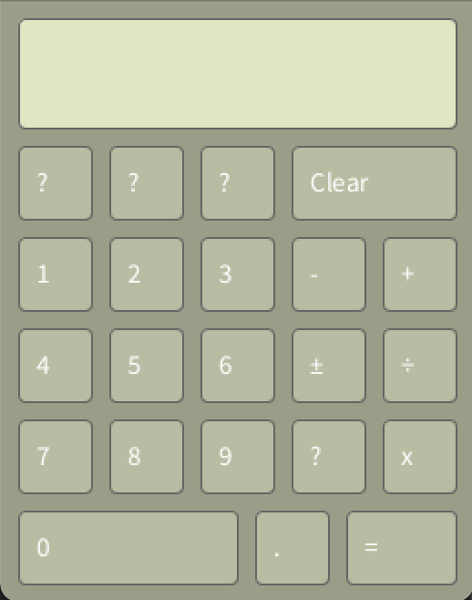

# Christina Wu's Programming portfolio

2021-2022 Programming Projects for Processing and Python.
(Wuchristina15@gmail.com)

## Processing Projects

### Calculator
OOP solution for a graphics based calculator

[Source Code](https://github.com/wchristinaa/Programming1/blob/gh-pages/SourceCode/Calculator.zip)

### SkyGame
00P solution for a colision based graphics sky shooter game

[Source Code](https://github.com/wchristinaa/Programming1/blob/gh-pages/SourceCode/SpaceGame.zip)

## Python Projects
